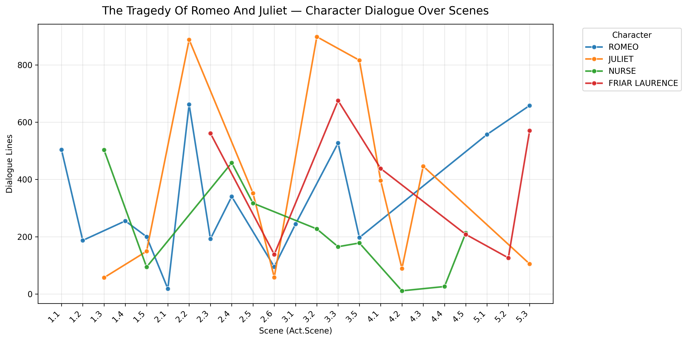
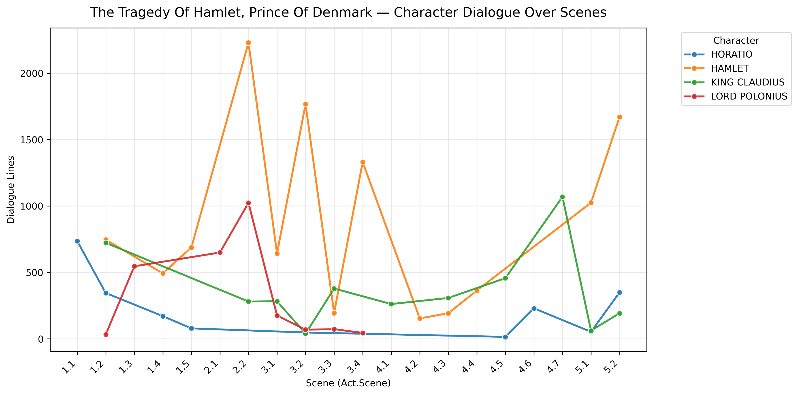
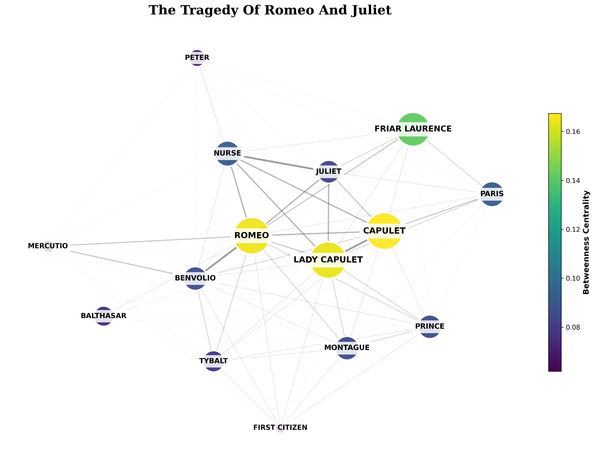
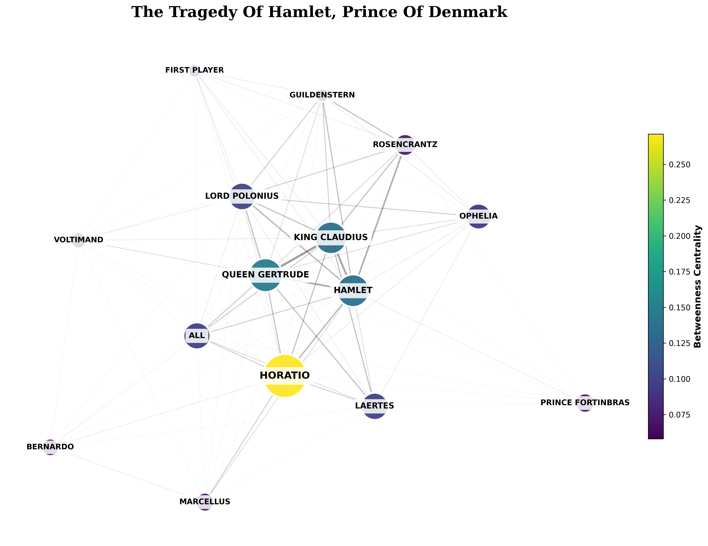
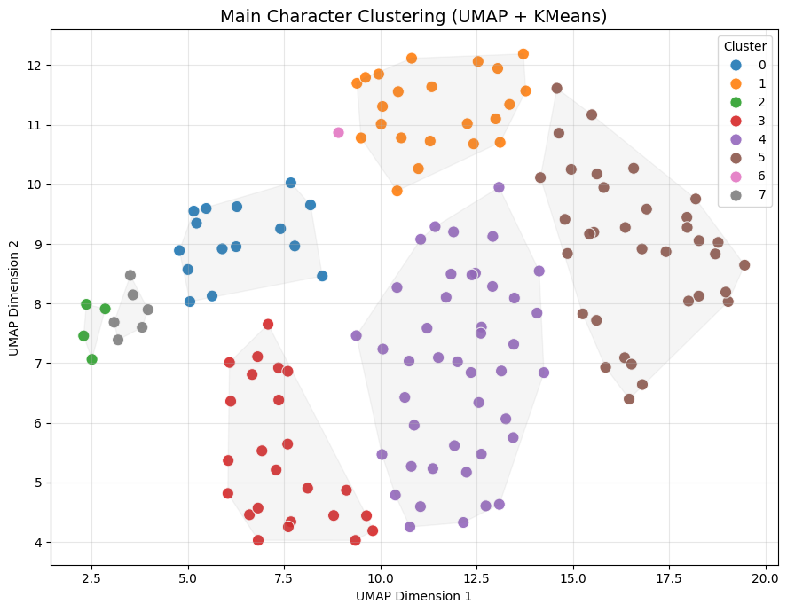

# EDA Summary

### Table of Contents
- [EDA Summary](#eda-summary)
    - [Table of Contents](#table-of-contents)
  - [What is your dataset and why did you choose it?](#what-is-your-dataset-and-why-did-you-choose-it)
  - [What did you learn from your EDA?](#what-did-you-learn-from-your-eda)
    - [Initial Ideas and Possible Issues](#initial-ideas-and-possible-issues)
    - [Visualizations](#visualizations)
  - [What issues or open questions remain?](#what-issues-or-open-questions-remain)


## What is your dataset and why did you choose it?

My chosen dataset is a set of Shakespeare plays from the nltk.corpus.shakespeare library. The plays in this library, available through the import of the library itself, are a set of XML trees with nested subtrees and descriptive tags for each part, such as `TITLE` and `PERSONAE` and `ACT` or `SPEECH`.

This dataset is slightly unconventional (or at least unfamiliar to the type of data I've looked at so far), but I wanted to look at data that was related to literature in some way (I have an appreciation for literature). After looking at various sets on sites like Kaggle, I found Shakespeare's plays to be a good data source as it has a specific, easily analyzed structure, it's public domain and easily accessible, and there is a lot of room to play around with it. 

My goal is to build a classifier for this dataset that looks at the data given by these plays and their characters to see if it can classify each character into an archetype. Specifically, I want to try to classify them into one of the groups resembling Campbell's 8 archetypes: The Hero, The Mentor, The Guardian, The Herald, The Ally, The Shadow, The Shapeshifter, the Trickster. Shakespeare's work, widely read and known as it is, has a good frame of reference for what characters "should" be or most likely are or maybe even what they're a mix of. 


## What did you learn from your EDA?

The immediate issue I ran into while starting my EDA is that there were no quantitative/qualitative stats for me to analyze from the raw data. A large portion of my time spent with the plays, of which 8 are available through nltk.corpus.shakespeare, was spent preprocessing and parsing through the plays in order to create CSVs with some quantitative measures so that I could actually measure and visualize the 'presence' of the characters throughout the plays, which is one of my main goals with this data. 

Different statistics I measured included the 'cast' of each play, the length and layout of each play, and each character's quantity of lines spoken, in which scenes, how often, with who, and the such. For the most part, I tried to focus on purely quantitative values so that I could analyze the characters and plays from a purely numerical standpoint. Luckily, the format of the XML tree of which the plays are presented in make this an easier task as I simply parse through each line and compile the data as needed.

### Initial Ideas and Possible Issues

In creating these csv's, I have 4 files each for each play plus additional csv's that combine statistics of all the plays. These files range from about 20-1500 lines of data, depending on the file, which I feel is plenty for me to work with. Although giving me a fair amount to look at and analyze, I do also believe that I will have to dive a little bit into sentiment analysis, as well, to give the current quantitative data some more substance. I want to cultivate a set of qualitative data that is purely derived from the play itself and not from any outside interpretation or knowledge. This step itself will most likely result in a lot of complexity, but I think it can provide even more interesting insight.


### Visualizations
With purely quantitative data, plus additional features such as the "time" of each event, I was able to create some interesting visualizations that could contribute to the development of the classifier.

Fo each play, I mapped the presence of each character throughout its duration from the number of lines they had in each scene. Below is an example for *Romeo and Juliet* and *Hamlet*, showing the amount spoken for the top 4 characters who spoke the most lines. 




Another set of data that I "created" from the other information about the characters' presence in each scene was an interaction matrix, or network. This visualized characters who appeared in scenes together, with thicker lines indicating more interactions and the size/color of each node indicating how many people (plus frequency) they interacted with. Below is an example from *Romeo and Juliet* and *Hamlet* again. 




For early attempts at a very crude non-model based classifier, I also applied K-Means clustering to the data and visualized it with UMAP. Features I used included: Total Lines, Dominance, Verbosity, Breadth, and Focus. These all measured how often they spoke individually, in comparison to a scene or speech, and to the overall length of a play of scene/act. 


```
Cluster summary (top 5 main characters per cluster)


  Cluster 0: 
OCTAVIUS CAESAR (The Tragedy of Antony and Cleopatra),
DOMITIUS ENOBARBUS (The Tragedy of Antony and Cleopatra),
SHYLOCK (The Merchant of Venice),
FRIAR LAURENCE (The Tragedy of Romeo and Juliet),
BASSANIO (The Merchant of Venice)

  Cluster 1: 
EGEUS (A Midsummer Night's Dream),
MONTAGUE (The Tragedy of Romeo and Juliet),
MARULLUS (The Tragedy of Julius Caesar),
VENTIDIUS (The Tragedy of Antony and Cleopatra),
CALPURNIA (The Tragedy of Julius Caesar)

  Cluster 2: 
HAMLET (The Tragedy of Hamlet, Prince of Denmark),
IAGO (The Tragedy of Othello, the Moor of Venice),
OTHELLO (The Tragedy of Othello, the Moor of Venice),
MARK ANTONY (The Tragedy of Antony and Cleopatra)

  Cluster 3: 
DESDEMONA (The Tragedy of Othello, the Moor of Venice),
HORATIO (The Tragedy of Hamlet, Prince of Denmark),
CASSIO (The Tragedy of Othello, the Moor of Venice),
EMILIA (The Tragedy of Othello, the Moor of Venice),
LAERTES (The Tragedy of Hamlet, Prince of Denmark)

  Cluster 4: 
LADY CAPULET (The Tragedy of Romeo and Juliet),
CHARMIAN (The Tragedy of Antony and Cleopatra),
LODOVICO (The Tragedy of Othello, the Moor of Venice),
LENNOX (The Tragedy of Macbeth),
DUKE OF VENICE (The Tragedy of Othello, the Moor of Venice)

  Cluster 5: 
REYNALDO (The Tragedy of Hamlet, Prince of Denmark),
MENTEITH (The Tragedy of Macbeth),
TUBAL (The Merchant of Venice),
FRANCISCO (The Tragedy of Hamlet, Prince of Denmark),
CLITUS (The Tragedy of Julius Caesar)

  Cluster 6: 
HECATE (The Tragedy of Macbeth)

  Cluster 7: 
MACBETH (The Tragedy of Macbeth),
CLEOPATRA (The Tragedy of Antony and Cleopatra),
ROMEO (The Tragedy of Romeo and Juliet),
PORTIA (The Merchant of Venice),
JULIET (The Tragedy of Romeo and Juliet)
```


## What issues or open questions remain?

I believe to do something more substantial with both the data and the classifier, I believe I will have to do dip into sentiment analysis. While I could also do TF-IDF and other methods I've already learned thus far, sentiment analysis seems to be the method that will provide a large amount of features that I could more easily tune a classifer with. However, so far from what I've looked into on sentiment analysis, it seems to be a very complex undertaking that could easily require more effort than I initally projected for this project. 
