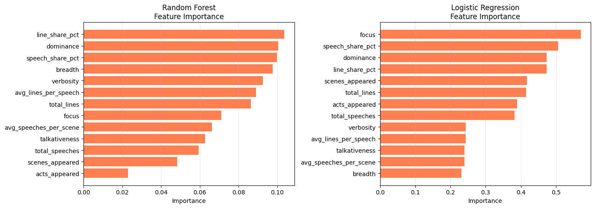
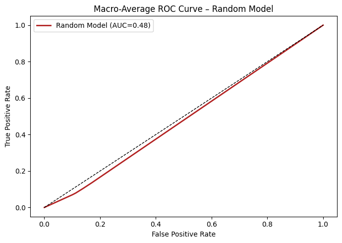
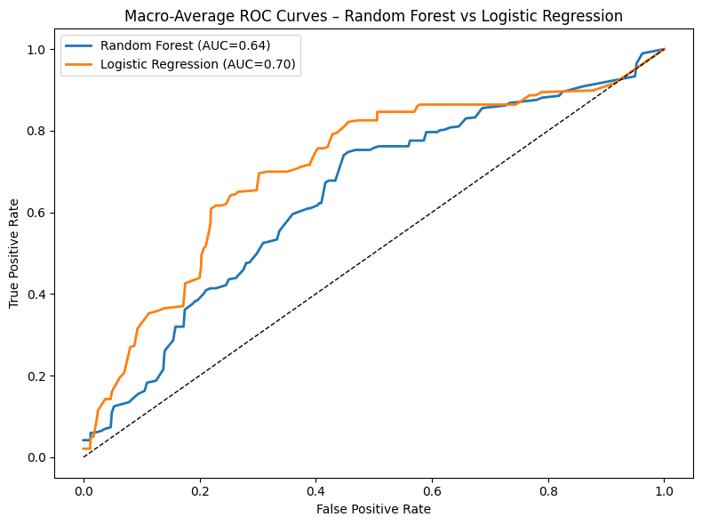

# First Draft Report

## Modeling and Feature Development

### True Random Model
I built a true random classifier model as a base baseline. This model just takes a list of the possible archetypes (Herald, Trickster, Shapeshifter, Ally, Threshold Guardian, Mentor, Hero, Shadow) and randomly assigns it to all the characters.

### Random Forest and Logistic Regression Model
The two other models I built for the classifier were the Random Forest model and the Logistic Regression model. These are two models that I am familiar with and that I know consistently perform well. For both models, I added very minimal parameters and just tweaked the `class_weight` to be balanced, limited the `n_estimators` and `max_iter`, and scaled for the logistic regression model. 

### Feature Development
For the models, I used the features that were included in my already compiled `all_plays_char_stats.csv` that combines the quantitative stats of all the characters from the 6 Shakespeare plays in the nltk.corpus.shakespeare library. I initially included every feature in the csv. Then, I went through and cut out every feature for each respective model that scored less than 0.3 on the feature importance, as long as it imporved the ROC AUC score. I thought about adding sentiment analysis features in this first draft but wanted to see how the purely quantitative features would perform. Surprisingly, they performed well. 

#### Before

#### After

## Model Evaluation
The evaluation of the models went as follows:

#### Random

#### Random Forest and Logistic Regression

The random forest achieved moderate accuracy (0.472) and ROC AUC (0.638) but low Macro F1 (0.232), indicating limited balance across classes. Its strength lies in capturing nonlinear relationships among features like verbosity and dominance, but it likely overfits and favors majority or highly talkative characters. Errors may stem from class imbalance and missing contextual information beyond quantitative speech metrics.

Logistic regression performed worse in accuracy (0.404) and Macro F1 (0.220) but achieved a higher ROC AUC (0.704), suggesting good ranking ability despite poor calibration. It is simple and interpretable but limited by linear assumptions and correlated features. Errors likely result from underfitting, class imbalance, and overly simplified feature interactions.

## Next Steps
Baseline performance for my two models is relatively high right off the bat. I plan to continue feature engineering and tweaking for both models since they have similar statistics across the board. My next plan of action is to start doing more work on sentiment analysis and TF-IDF to create more potentially relevant features and hopefully raise the ROC-AUC more. 
